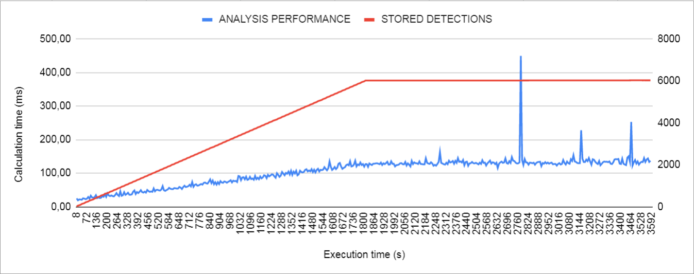
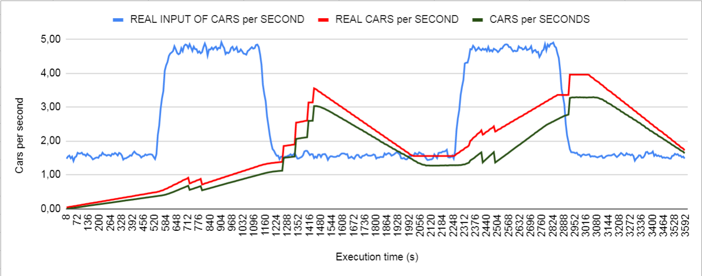
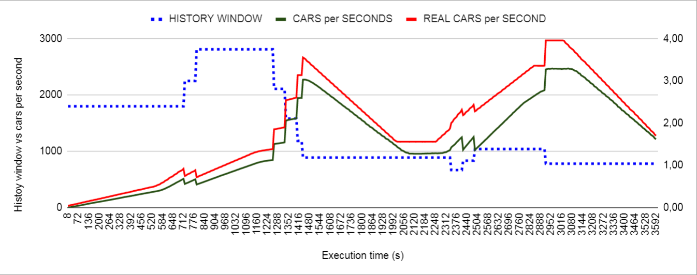

# Usage instruction

1. Please read the README.md file first and install all necessary components first

2. go to **elastic-smart-contracts/ESC-network/ExperimentSetElasticity** and run ./launchExperimentsElastic.sh with the necessary parameters, if you run it without any, an error message will appear explaining each parameter:

- **Number of sensors**: number of sensors to simulate in the experiments.

- **Execution time**: time in seconds for the experiment to run.

- **Calculation frequency**: frequency in seconds for the experiment to run a flow calculation.

- **Sensor update frequency**: frequency for the sensors to insert data into the Blockchain.

- **Time window**: number of seconds for the data to be kept as valid data in the Blockchain for flow calculations.

- **Elasticity evaluation frequency**: number of calculation between each evaluation of the system performance in order to make use of the elasticity if necessary.

- **Street length**: number of kilometers of the simulated street.

- **Maximum time**: number of miliseconds allow at most for the system to apply elasticity. (Elasticity parameter)

- **Minimum time**: number of miliseconds allow at least for the system to apply elasticity. (Elasticity parameter)

Each one of these parameters must be given in order, an example of a correct use of the script is shown if the error message for the wrong number of parameters appears:

```
./launchExperimentsElastic.sh 4 3600 8 1 1800 5 1 100 50
```

The parameters of this example are the same used in the graphs shown at the end of the document. The script will execute 3 experiments so be aware that the execution time you use will be multiplied by 3.

For each one of those experiments 2 CSV files will be generated in the "results" folder with a timestamp of the execution date and a prefix for each experiment: "testNoElastic", "testFrequency" and "testTimeWindow". the three experiment test the system without any elasticity, with the frequency of update of sensors as elasticity parameter and the time window for the data to be stored as elasticity parameter, respectively.

3. Wait for the network to start up and run the experiments! Once it is finished it will shut down itself. The estimated duration of these experiments is between three and three and a half hours

4. The results will be written in a series of .csv files inside **elastic-smart-contracts/ESC-network/main/results**

# Results interpretation

Two .csv files will be generated for each experiments, one containing the analytics of each calculation flow executed during the experiment, and the other with the general statistics of the whole experiment.

1. The .csv for the statistics of the experiment consist in a single row of data for each experiment executed, the description of each column are as follows:

- **NUMBER_SENSORS**: number of sensors used in the experiment.

- **FREQUENCY**: frequency in seconds of execution of a flow calculation.

- **TIME_DATA**: temporal window in seconds for data to be stored and used in the calculation.

- **MIN_TIME**: minimum execution time of a flow calculation registered during the experiment.

- **MAX_TIME**: maximum execution time of a flow calculation registered during the experiment.

- **AVG_TIME**: average execution time of all flow calculations registered during the experiment.

- **STD_TIME**: standar deviation of the execution time of all flow calculations registered during the experiment.

- **SUCCESFUL_CALCULATIONS**: number of flow calculations executed successfully.

- **CALCULATIONS_OVER_MAX**: number of flow calculations with an execution time at least 50% more of the maximum execution time allowed by elasticity rules.

2. The .csv for the calculations of the experiment consist in a row of data for each execution of a flow calculation, the description of each column are as follows:

- **NUMBER_SENSORS**: number of sensors used in the experiment.

- **NUMBER_DETECTIONS**: number of cars detected in total, note that a single car can be detected once per sensor.

- **TOTAL_TIME**: execution time of the flow calculation.

- **CARS_PER_SECOND_BY_SENSOR**: array containing the calculation of traffic flow for each sector covered by a sensor.

- **CARS_PER_SECOND_TOTAL**: flow of cars calculated for the whole street.

- **REAL_CARS_PER_SECOND**: real flow of cars having into consideration the data straight from the csv of cars used to simulate the flow, this flow is for the   inmediate time of the calculation.

- **REAL_CARS_PER_SECOND_TOTAL**: real flow of cars having into consideration the data straight from the csv of cars used to simulate the flow, the difference between this column and the previous one is that this one takes the flow for the entire time window given, instead of the inmediate time alone.

- **FREQUENCY**: frequency in seconds of execution of a flow calculation.

- **TIME_DATA**: temporal window in seconds for data to be stored and used in the calculation.

- **FREQUENCY_DATA**: frequency in seconds for sensors to insert data in the blockchain.

- **DETECTIONS_STORED**: number of "detections" objects stored in the blockchain at the time of the calculation, note that a detection object can contain more than 1 car detected.

- **FROM_DATE**: time in miliseconds to get data for the calculation between this column and TO_DATE column.

- **TO_DATE**: time in miliseconds to get data for the calculation between this column and FROM_DATE column.

- **MINIMUM_TIME**: minimum execution time established by elasticity rules.

- **MAXIMUM_TIME**: maximum execution time established by elasticity rules.

# Data usage

There are 3 principal graphics made to use the results data from the calculations result csv file, but these are just examples as more you can have more uses for the data:

1. Comparison between the calculated flow (**CARS_PER_SECOND_TOTAL**), the real flow (**REAL_CARS_PER_SECOND_TOTAL**) and the real instantaneous flow (**REAL_CARS_PER_SECOND**):



2. Graphic used to observe how the amount of detections objects stored (**DETECTIONS_STORED**) affects the execution time (**TOTAL_TIME**) :



3. Graphic comparing the changes to frequency update (**FREQUENCY_DATA**) or time window (**TIME_DATA**) and the calculation of cars per second (**CARS_PER_SECOND_TOTAL** and **REAL_CARS_PER_SECOND_TOTAL**) , to see how it affects the calculation  result, the next one compares it against time window:



**In order to correctly use the data you should import it from the CSV file and be sure that every column has the correct format (number)**
